```mermaid
graph TB
    subgraph "Client Layer"
        A[Next.js 15 App]
        B[PWA Service Worker]
        C[React Query Cache]
    end
    
    subgraph "Edge Layer"
        D[Vercel Edge Network]
        E[CDN Cache]
        F[Edge Functions]
    end
    
    subgraph "API Layer"
        G[Next.js API Routes]
        H[Supabase Edge Functions]
        I[Middleware Layer]
    end
    
    subgraph "Data Layer"
        J[Supabase PostgreSQL]
        K[Supabase Storage]
        L[Redis Cache]
    end
    
    subgraph "External Services"
        M[GitHub API]
        N[Analytics]
        O[Monitoring]
    end
    
    A --> D
    D --> G
    G --> J
    G --> K
    A --> C
    F --> H
    H --> J
    G --> L
    
    style A fill:#61dafb
    style J fill:#3ecf8e
    style D fill:#000000
```

# 🏗️ System Architecture & Design - Codepacker Catalog

## 📋 Executive Summary

Arsitektur modern, scalable, dan cost-effective untuk platform katalog portofolio siswa RPL dengan pendekatan **Jamstack + Edge Computing** menggunakan tech stack terbaru tanpa biaya tambahan.

## 🎯 Architecture Principles

### **1. Scalability First**
- **Horizontal scaling** dengan serverless architecture
- **Edge computing** untuk global performance
- **Microservices pattern** dengan modular design
- **Database sharding** ready untuk growth

### **2. Performance Optimization**
- **Sub-second loading** dengan SSG + ISR
- **Edge caching** dengan CDN
- **Image optimization** dengan modern formats
- **Code splitting** dan lazy loading

### **3. Developer Experience**
- **Type-safe** development dengan TypeScript
- **Component-driven** development
- **Hot reload** dan fast refresh
- **Automated testing** dan deployment

### **4. Cost Efficiency**
- **Serverless-first** approach
- **Pay-per-use** model
- **Free tier optimization**
- **Resource pooling**

---

## 🏛️ High-Level Architecture



---

## 🔧 Technology Stack

### **Frontend Stack**
```typescript
// Core Framework
Next.js 15.4.6          // React framework with App Router
React 19                // Latest React with concurrent features
TypeScript 5.3+         // Type safety and developer experience

// Styling & UI
Tailwind CSS 4          // Utility-first CSS framework
ShadCN-UI               // High-quality component library
Framer Motion           // Animation library
Lucide React            // Icon library

// State Management
Zustand                 // Lightweight state management
React Query (TanStack)  // Server state management
React Hook Form         // Form state management

// Development Tools
ESLint 9                // Code linting
Prettier                // Code formatting
Husky                   // Git hooks
Lint-staged             // Pre-commit linting
```

### **Backend Stack**
```typescript
// Database & Auth
Supabase PostgreSQL     // Primary database
Supabase Auth           // Authentication service
Supabase Storage        // File storage
Supabase Edge Functions // Serverless functions

// Caching & Performance
Redis (Upstash)         // Edge caching
React Query             // Client-side caching
Next.js Cache           // Build-time caching

// Monitoring & Analytics
Vercel Analytics        // Performance monitoring
Sentry                  // Error tracking
PostHog                 // Product analytics
```

### **DevOps & Deployment**
```yaml
# Deployment
Platform: Vercel        # Serverless deployment
CDN: Vercel Edge Network # Global content delivery
Domain: Custom domain   # Professional branding

# CI/CD
GitHub Actions          # Automated workflows
Vercel Preview          # Branch previews
Automated Testing       # Unit + E2E tests

# Monitoring
Uptime Monitoring       # Service availability
Performance Monitoring  # Core Web Vitals
Error Tracking          # Real-time error alerts
```

---

## 🏗️ Detailed Architecture Layers

### **1. Presentation Layer (Frontend)**

#### **Component Architecture**
```
src/
├── app/                    # Next.js App Router
│   ├── (auth)/            # Auth route group
│   ├── (dashboard)/       # Dashboard route group
│   ├── globals.css        # Global styles
│   ├── layout.tsx         # Root layout
│   └── page.tsx           # Landing page
├── components/            # Reusable components
│   ├── ui/               # ShadCN base components
│   ├── forms/            # Form components
│   ├── layouts/          # Layout components
│   ├── features/         # Feature-specific components
│   └── common/           # Common components
├── lib/                  # Utility libraries
│   ├── auth.ts           # Auth utilities
│   ├── db.ts             # Database client
│   ├── utils.ts          # General utilities
│   ├── validations.ts    # Zod schemas
│   └── constants.ts      # App constants
├── hooks/                # Custom React hooks
├── stores/               # Zustand stores
├── types/                # TypeScript types
└── styles/               # Additional styles
```

#### **State Management Strategy**
```typescript
// Global State (Zustand)
interface AppStore {
  user: User | null;
  theme: 'light' | 'dark';
  sidebar: boolean;
  setUser: (user: User | null) => void;
  toggleTheme: () => void;
  toggleSidebar: () => void;
}

// Server State (React Query)
const useProjects = () => useQuery({
  queryKey: ['projects'],
  queryFn: fetchProjects,
  staleTime: 5 * 60 * 1000, // 5 minutes
});

// Form State (React Hook Form)
const useProjectForm = () => useForm<ProjectSchema>({
  resolver: zodResolver(projectSchema),
  defaultValues: defaultProjectValues,
});
```

### **2. API Layer (Backend)**

#### **API Route Structure**
```
src/app/api/
├── auth/
│   ├── login/route.ts
│   ├── register/route.ts
│   └── logout/route.ts
├── students/
│   ├── route.ts              # GET /api/students
│   ├── [id]/route.ts         # GET/PUT/DELETE /api/students/[id]
│   └── [id]/projects/route.ts # GET /api/students/[id]/projects
├── projects/
│   ├── route.ts              # GET/POST /api/projects
│   ├── [id]/route.ts         # GET/PUT/DELETE /api/projects/[id]
│   └── featured/route.ts     # GET /api/projects/featured
├── admin/
│   ├── dashboard/route.ts    # GET /api/admin/dashboard
│   ├── users/route.ts        # GET/POST /api/admin/users
│   └── settings/route.ts     # GET/PUT /api/admin/settings
└── upload/
    ├── image/route.ts        # POST /api/upload/image
    └── video/route.ts        # POST /api/upload/video
```

#### **Middleware Stack**
```typescript
// Authentication Middleware
export async function authMiddleware(request: NextRequest) {
  const token = request.cookies.get('auth-token');
  const user = await verifyToken(token);
  
  if (!user && isProtectedRoute(request.nextUrl.pathname)) {
    return NextResponse.redirect('/login');
  }
  
  return NextResponse.next();
}

// Rate Limiting Middleware
export async function rateLimitMiddleware(request: NextRequest) {
  const ip = request.ip || 'anonymous';
  const limit = await checkRateLimit(ip);
  
  if (!limit.success) {
    return new Response('Too Many Requests', { status: 429 });
  }
  
  return NextResponse.next();
}

// CORS Middleware
export async function corsMiddleware(request: NextRequest) {
  const response = NextResponse.next();
  
  response.headers.set('Access-Control-Allow-Origin', '*');
  response.headers.set('Access-Control-Allow-Methods', 'GET,POST,PUT,DELETE');
  response.headers.set('Access-Control-Allow-Headers', 'Content-Type,Authorization');
  
  return response;
}
```

### **3. Data Layer**

#### **Database Access Pattern**
```typescript
// Repository Pattern
class StudentRepository {
  private supabase = createClient();
  
  async findById(id: string): Promise<Student | null> {
    const { data, error } = await this.supabase
      .from('student_details')
      .select('*')
      .eq('id', id)
      .single();
      
    if (error) throw new DatabaseError(error.message);
    return data;
  }
  
  async findWithPagination(params: PaginationParams): Promise<PaginatedResponse<Student>> {
    const { page = 1, limit = 10, search, filters } = params;
    const offset = (page - 1) * limit;
    
    let query = this.supabase
      .from('top_students')
      .select('*', { count: 'exact' });
    
    if (search) {
      query = query.textSearch('name', search);
    }
    
    if (filters?.class_id) {
      query = query.eq('class_id', filters.class_id);
    }
    
    const { data, error, count } = await query
      .range(offset, offset + limit - 1)
      .order('total_views', { ascending: false });
    
    if (error) throw new DatabaseError(error.message);
    
    return {
      data: data || [],
      pagination: {
        page,
        limit,
        total: count || 0,
        total_pages: Math.ceil((count || 0) / limit),
        has_next: page * limit < (count || 0),
        has_prev: page > 1,
      },
    };
  }
}

// Service Layer
class StudentService {
  constructor(private repository: StudentRepository) {}
  
  async getStudentProfile(id: string): Promise<StudentDetail> {
    const student = await this.repository.findById(id);
    if (!student) throw new NotFoundError('Student not found');
    
    // Increment view count
    await this.incrementViewCount(id, 'student');
    
    return student;
  }
  
  private async incrementViewCount(id: string, type: 'student' | 'project') {
    await this.supabase.rpc('increment_view_count', {
      p_viewable_type: type,
      p_viewable_id: id,
      p_viewer_type: 'guest',
    });
  }
}
```

#### **Caching Strategy**
```typescript
// Multi-layer Caching
class CacheService {
  private redis = new Redis(process.env.REDIS_URL);
  
  // L1: React Query (Client-side)
  async getStudents(params: StudentFilters) {
    return useQuery({
      queryKey: ['students', params],
      queryFn: () => this.fetchStudents(params),
      staleTime: 5 * 60 * 1000, // 5 minutes
      cacheTime: 10 * 60 * 1000, // 10 minutes
    });
  }
  
  // L2: Redis (Server-side)
  async getCachedData<T>(key: string): Promise<T | null> {
    const cached = await this.redis.get(key);
    return cached ? JSON.parse(cached) : null;
  }
  
  async setCachedData<T>(key: string, data: T, ttl: number = 300): Promise<void> {
    await this.redis.setex(key, ttl, JSON.stringify(data));
  }
  
  // L3: Next.js Cache (Build-time)
  async getStaticData() {
    return unstable_cache(
      async () => {
        return await this.fetchStaticData();
      },
      ['static-data'],
      { revalidate: 3600 } // 1 hour
    );
  }
}
```

---

## 🔐 Security Architecture

### **Authentication & Authorization**
```typescript
// JWT + RLS Security Model
interface SecurityContext {
  user: AuthUser;
  permissions: Permission[];
  session: Session;
}

// Role-based Access Control
enum Permission {
  READ_STUDENTS = 'read:students',
  WRITE_STUDENTS = 'write:students',
  READ_PROJECTS = 'read:projects',
  WRITE_PROJECTS = 'write:projects',
  ADMIN_ACCESS = 'admin:access',
}

// Permission Middleware
export function requirePermission(permission: Permission) {
  return async (req: NextRequest, context: SecurityContext) => {
    if (!context.permissions.includes(permission)) {
      throw new ForbiddenError('Insufficient permissions');
    }
  };
}
```

### **Data Protection**
```typescript
// Input Validation with Zod
const studentSchema = z.object({
  name: z.string().min(2).max(100),
  bio: z.string().max(500).optional(),
  github_username: z.string().regex(/^[a-zA-Z0-9-]+$/).optional(),
  linkedin_url: z.string().url().optional(),
});

// SQL Injection Prevention
// Using Supabase's built-in parameterized queries
const { data, error } = await supabase
  .from('students')
  .select('*')
  .eq('id', studentId) // Automatically parameterized
  .single();

// XSS Prevention
import DOMPurify from 'dompurify';

function sanitizeHTML(html: string): string {
  return DOMPurify.sanitize(html);
}
```

---

## 📊 Performance Optimization

### **Frontend Performance**
```typescript
// Code Splitting
const StudentDashboard = lazy(() => import('./StudentDashboard'));
const ProjectEditor = lazy(() => import('./ProjectEditor'));

// Image Optimization
import Image from 'next/image';

<Image
  src={student.profile_image_url}
  alt={student.name}
  width={200}
  height={200}
  priority={isAboveFold}
  placeholder="blur"
  blurDataURL="data:image/jpeg;base64,..."
/>

// Bundle Analysis
// next.config.js
const withBundleAnalyzer = require('@next/bundle-analyzer')({
  enabled: process.env.ANALYZE === 'true',
});

module.exports = withBundleAnalyzer({
  experimental: {
    optimizeCss: true,
    optimizePackageImports: ['lucide-react', '@radix-ui/react-icons'],
  },
});
```

### **Backend Performance**
```typescript
// Database Query Optimization
// Use views for complex queries
const { data } = await supabase
  .from('top_projects') // Pre-optimized view
  .select('*')
  .limit(10);

// Connection Pooling
const supabase = createClient(url, key, {
  db: {
    schema: 'public',
  },
  auth: {
    persistSession: true,
  },
  global: {
    headers: { 'x-my-custom-header': 'my-app-name' },
  },
});

// Edge Functions for Heavy Operations
// supabase/functions/analytics/index.ts
export default async function handler(req: Request) {
  const { data } = await supabase
    .from('views_log')
    .select('*')
    .gte('created_at', new Date(Date.now() - 24 * 60 * 60 * 1000));
  
  const analytics = processAnalytics(data);
  
  return new Response(JSON.stringify(analytics), {
    headers: { 'Content-Type': 'application/json' },
  });
}
```

---

## 🚀 Deployment & DevOps

### **CI/CD Pipeline**
```yaml
# .github/workflows/deploy.yml
name: Deploy to Vercel

on:
  push:
    branches: [main, develop]
  pull_request:
    branches: [main]

jobs:
  test:
    runs-on: ubuntu-latest
    steps:
      - uses: actions/checkout@v4
      - uses: actions/setup-node@v4
        with:
          node-version: '20'
          cache: 'npm'
      
      - run: npm ci
      - run: npm run lint
      - run: npm run type-check
      - run: npm run test
      - run: npm run build

  deploy:
    needs: test
    runs-on: ubuntu-latest
    if: github.ref == 'refs/heads/main'
    steps:
      - uses: actions/checkout@v4
      - uses: amondnet/vercel-action@v25
        with:
          vercel-token: ${{ secrets.VERCEL_TOKEN }}
          vercel-org-id: ${{ secrets.ORG_ID }}
          vercel-project-id: ${{ secrets.PROJECT_ID }}
          vercel-args: '--prod'
```

### **Environment Configuration**
```typescript
// Environment Variables
interface Environment {
  // Database
  NEXT_PUBLIC_SUPABASE_URL: string;
  NEXT_PUBLIC_SUPABASE_ANON_KEY: string;
  SUPABASE_SERVICE_ROLE_KEY: string;
  
  // Caching
  REDIS_URL: string;
  
  // Monitoring
  SENTRY_DSN: string;
  VERCEL_ANALYTICS_ID: string;
  
  // External APIs
  GITHUB_TOKEN: string;
  
  // Security
  JWT_SECRET: string;
  ENCRYPTION_KEY: string;
}

// Configuration Management
const config = {
  database: {
    url: process.env.NEXT_PUBLIC_SUPABASE_URL!,
    key: process.env.NEXT_PUBLIC_SUPABASE_ANON_KEY!,
  },
  cache: {
    redis: process.env.REDIS_URL!,
    ttl: {
      short: 5 * 60, // 5 minutes
      medium: 30 * 60, // 30 minutes
      long: 24 * 60 * 60, // 24 hours
    },
  },
  monitoring: {
    sentry: process.env.SENTRY_DSN!,
    analytics: process.env.VERCEL_ANALYTICS_ID!,
  },
};
```

---

## 📈 Monitoring & Analytics

### **Performance Monitoring**
```typescript
// Core Web Vitals Tracking
import { getCLS, getFID, getFCP, getLCP, getTTFB } from 'web-vitals';

function sendToAnalytics(metric: Metric) {
  // Send to Vercel Analytics
  analytics.track('web-vital', {
    name: metric.name,
    value: metric.value,
    id: metric.id,
  });
}

getCLS(sendToAnalytics);
getFID(sendToAnalytics);
getFCP(sendToAnalytics);
getLCP(sendToAnalytics);
getTTFB(sendToAnalytics);

// Custom Performance Metrics
const performanceObserver = new PerformanceObserver((list) => {
  list.getEntries().forEach((entry) => {
    if (entry.entryType === 'navigation') {
      analytics.track('page-load', {
        url: window.location.pathname,
        loadTime: entry.loadEventEnd - entry.loadEventStart,
      });
    }
  });
});

performanceObserver.observe({ entryTypes: ['navigation'] });
```

### **Error Tracking**
```typescript
// Sentry Configuration
import * as Sentry from '@sentry/nextjs';

Sentry.init({
  dsn: process.env.SENTRY_DSN,
  environment: process.env.NODE_ENV,
  tracesSampleRate: 1.0,
  beforeSend(event) {
    // Filter out non-critical errors
    if (event.exception) {
      const error = event.exception.values?.[0];
      if (error?.type === 'ChunkLoadError') {
        return null; // Don't send chunk load errors
      }
    }
    return event;
  },
});

// Custom Error Boundary
class ErrorBoundary extends Component {
  componentDidCatch(error: Error, errorInfo: ErrorInfo) {
    Sentry.captureException(error, {
      contexts: {
        react: {
          componentStack: errorInfo.componentStack,
        },
      },
    });
  }
}
```

---

## 🔄 Scalability Considerations

### **Horizontal Scaling**
```typescript
// Database Scaling Strategy
interface ScalingConfig {
  // Read Replicas
  readReplicas: {
    primary: string;
    replicas: string[];
  };
  
  // Connection Pooling
  connectionPool: {
    min: number;
    max: number;
    idleTimeout: number;
  };
  
  // Caching Layers
  cache: {
    l1: 'react-query';    // Client-side
    l2: 'redis';          // Server-side
    l3: 'cdn';            // Edge
  };
}

// Load Balancing
const databaseRouter = {
  read: (query: string) => {
    const replica = selectReadReplica();
    return replica.query(query);
  },
  
  write: (query: string) => {
    return primaryDatabase.query(query);
  },
};
```

### **Performance Budgets**
```typescript
// Performance Budgets
const performanceBudgets = {
  // Bundle Size
  javascript: '250KB', // Gzipped
  css: '50KB',         // Gzipped
  images: '500KB',     // Per page
  
  // Runtime Performance
  fcp: '1.5s',         // First Contentful Paint
  lcp: '2.5s',         // Largest Contentful Paint
  fid: '100ms',        // First Input Delay
  cls: '0.1',          // Cumulative Layout Shift
  
  // API Response Times
  api: '200ms',        // 95th percentile
  database: '50ms',    // Query time
};

// Automated Performance Testing
// lighthouse.config.js
module.exports = {
  ci: {
    collect: {
      url: ['http://localhost:3000'],
      numberOfRuns: 3,
    },
    assert: {
      assertions: {
        'categories:performance': ['error', { minScore: 0.9 }],
        'categories:accessibility': ['error', { minScore: 0.9 }],
        'categories:best-practices': ['error', { minScore: 0.9 }],
        'categories:seo': ['error', { minScore: 0.9 }],
      },
    },
  },
};
```

---

## 💰 Cost Optimization

### **Resource Optimization**
```typescript
// Free Tier Optimization
const resourceLimits = {
  vercel: {
    bandwidth: '100GB/month',
    builds: '6000 minutes/month',
    functions: '100GB-hours/month',
  },
  
  supabase: {
    database: '500MB storage',
    bandwidth: '5GB/month',
    auth: '50,000 MAU',
    storage: '1GB',
  },
  
  upstash: {
    redis: '10,000 commands/day',
    storage: '256MB',
  },
};

// Cost Monitoring
class CostMonitor {
  async checkUsage() {
    const usage = await Promise.all([
      this.getVercelUsage(),
      this.getSupabaseUsage(),
      this.getUpstashUsage(),
    ]);
    
    const alerts = usage
      .filter(service => service.usage > service.limit * 0.8)
      .map(service => ({
        service: service.name,
        usage: service.usage,
        limit: service.limit,
        percentage: (service.usage / service.limit) * 100,
      }));
    
    if (alerts.length > 0) {
      await this.sendCostAlert(alerts);
    }
  }
}
```

---

## 🎯 Success Metrics

### **Technical KPIs**
```typescript
interface TechnicalKPIs {
  performance: {
    pageLoadTime: '< 2s';
    apiResponseTime: '< 200ms';
    uptime: '> 99.9%';
    errorRate: '< 0.1%';
  };
  
  scalability: {
    concurrentUsers: '1000+';
    requestsPerSecond: '100+';
    databaseConnections: '< 80% pool';
  };
  
  security: {
    vulnerabilities: '0 critical';
    authFailures: '< 1%';
    dataBreaches: '0';
  };
}
```

### **Business KPIs**
```typescript
interface BusinessKPIs {
  engagement: {
    dailyActiveUsers: number;
    sessionDuration: number;
    pageViews: number;
    bounceRate: number;
  };
  
  content: {
    totalStudents: number;
    totalProjects: number;
    profileCompletionRate: number;
    projectViewRate: number;
  };
  
  growth: {
    newStudentSignups: number;
    projectSubmissions: number;
    monthlyGrowthRate: number;
  };
}
```

---

## 🔐 Security Architecture

### **Security Layers**
```typescript
// 1. Network Security
// - HTTPS enforcement
// - CORS configuration
// - Rate limiting
// - DDoS protection (Vercel)

// 2. Authentication Security
// - JWT tokens with short expiry
// - Refresh token rotation
// - Session management
// - Multi-factor authentication ready

// 3. Authorization Security
// - Row Level Security (RLS)
// - Role-based access control
// - Resource-level permissions
// - API endpoint protection

// 4. Data Security
// - Input validation with Zod
// - SQL injection prevention
// - XSS protection
// - CSRF protection
// - Data encryption at rest

// 5. Application Security
// - Secure headers
// - Content Security Policy
// - Dependency vulnerability scanning
// - Error handling without data leaks
```

### **Security Implementation**
```typescript
// Security Headers Middleware
export function securityHeaders(request: NextRequest) {
  const response = NextResponse.next();

  response.headers.set('X-Content-Type-Options', 'nosniff');
  response.headers.set('X-Frame-Options', 'DENY');
  response.headers.set('X-XSS-Protection', '1; mode=block');
  response.headers.set('Referrer-Policy', 'strict-origin-when-cross-origin');
  response.headers.set('Permissions-Policy', 'camera=(), microphone=(), geolocation=()');

  // Content Security Policy
  response.headers.set('Content-Security-Policy', [
    "default-src 'self'",
    "script-src 'self' 'unsafe-inline' 'unsafe-eval' https://vercel.live",
    "style-src 'self' 'unsafe-inline' https://fonts.googleapis.com",
    "font-src 'self' https://fonts.gstatic.com",
    "img-src 'self' data: https: blob:",
    "connect-src 'self' https://*.supabase.co wss://*.supabase.co",
  ].join('; '));

  return response;
}

// Input Sanitization
import DOMPurify from 'dompurify';

export function sanitizeInput(input: string): string {
  return DOMPurify.sanitize(input, {
    ALLOWED_TAGS: ['b', 'i', 'em', 'strong', 'p', 'br'],
    ALLOWED_ATTR: [],
  });
}

// Rate Limiting per User
export async function userRateLimit(userId: string, action: string) {
  const key = `rate_limit:${userId}:${action}`;
  const current = await redis.get(key);

  if (current && parseInt(current) > 100) {
    throw new RateLimitError('User rate limit exceeded');
  }

  await redis.incr(key);
  await redis.expire(key, 3600); // 1 hour window
}
```

---

## 🚀 Deployment Architecture

### **Multi-Environment Strategy**
```typescript
// Environment Configuration
interface EnvironmentConfig {
  development: {
    database: 'local_supabase';
    cache: 'local_redis';
    storage: 'local_storage';
    analytics: 'disabled';
  };
  staging: {
    database: 'staging_supabase';
    cache: 'staging_redis';
    storage: 'staging_storage';
    analytics: 'enabled';
  };
  production: {
    database: 'prod_supabase';
    cache: 'prod_redis';
    storage: 'prod_storage';
    analytics: 'enabled';
  };
}

// Feature Flags
export const featureFlags = {
  enableAnalytics: process.env.NODE_ENV === 'production',
  enableCaching: true,
  enableRateLimit: process.env.NODE_ENV !== 'development',
  enableErrorTracking: process.env.NODE_ENV === 'production',
  maxFileSize: process.env.NODE_ENV === 'production' ? 10 : 50, // MB
};
```

### **Blue-Green Deployment**
```yaml
# .github/workflows/deploy.yml
name: Blue-Green Deployment

on:
  push:
    branches: [main]

jobs:
  deploy:
    runs-on: ubuntu-latest
    steps:
      - name: Deploy to Staging
        uses: amondnet/vercel-action@v25
        with:
          vercel-token: ${{ secrets.VERCEL_TOKEN }}
          vercel-args: '--env staging'

      - name: Run E2E Tests
        run: npm run e2e:staging

      - name: Deploy to Production
        if: success()
        uses: amondnet/vercel-action@v25
        with:
          vercel-token: ${{ secrets.VERCEL_TOKEN }}
          vercel-args: '--prod'
```

---

## 📊 Observability & Monitoring

### **Comprehensive Monitoring Stack**
```typescript
// Application Performance Monitoring
export class APMService {
  private static instance: APMService;

  static getInstance() {
    if (!APMService.instance) {
      APMService.instance = new APMService();
    }
    return APMService.instance;
  }

  // Performance Metrics
  trackPageLoad(route: string, loadTime: number) {
    analytics.track('Page Load', {
      route,
      loadTime,
      timestamp: Date.now(),
    });
  }

  // Error Tracking
  trackError(error: Error, context?: Record<string, any>) {
    console.error('Application Error:', error);

    if (process.env.NODE_ENV === 'production') {
      // Send to error tracking service
      errorTracker.captureException(error, { extra: context });
    }
  }

  // Business Metrics
  trackUserAction(action: string, userId?: string, metadata?: Record<string, any>) {
    analytics.track('User Action', {
      action,
      userId,
      metadata,
      timestamp: Date.now(),
    });
  }

  // System Health
  async checkSystemHealth(): Promise<HealthStatus> {
    const checks = await Promise.allSettled([
      this.checkDatabase(),
      this.checkCache(),
      this.checkStorage(),
      this.checkExternalAPIs(),
    ]);

    return {
      status: checks.every(check => check.status === 'fulfilled') ? 'healthy' : 'degraded',
      checks: checks.map((check, index) => ({
        service: ['database', 'cache', 'storage', 'external'][index],
        status: check.status,
        latency: check.status === 'fulfilled' ? check.value.latency : null,
      })),
      timestamp: new Date().toISOString(),
    };
  }
}

// Health Check Endpoint
// src/app/api/health/route.ts
export async function GET() {
  const apm = APMService.getInstance();
  const health = await apm.checkSystemHealth();

  return NextResponse.json(health, {
    status: health.status === 'healthy' ? 200 : 503,
  });
}
```

---

## 🔄 Disaster Recovery

### **Backup & Recovery Strategy**
```typescript
// Automated Backup System
export class BackupService {
  // Database Backup
  async backupDatabase() {
    // Supabase handles automated backups
    // Additional custom backup for critical data
    const criticalTables = ['users', 'students', 'projects'];

    for (const table of criticalTables) {
      const data = await supabase.from(table).select('*');
      await this.storeBackup(table, data);
    }
  }

  // File Backup
  async backupFiles() {
    // Supabase Storage has built-in redundancy
    // Additional backup for critical files
    const criticalFiles = await this.getCriticalFiles();

    for (const file of criticalFiles) {
      await this.backupToSecondaryStorage(file);
    }
  }

  // Recovery Procedures
  async recoverFromBackup(backupId: string) {
    const backup = await this.getBackup(backupId);

    // Validate backup integrity
    if (!this.validateBackup(backup)) {
      throw new Error('Backup validation failed');
    }

    // Restore data
    await this.restoreData(backup);

    // Verify restoration
    await this.verifyRestoration();
  }
}

// Incident Response
export class IncidentResponse {
  async handleIncident(incident: Incident) {
    // 1. Immediate Response
    await this.alertTeam(incident);
    await this.activateIncidentChannel();

    // 2. Assessment
    const impact = await this.assessImpact(incident);

    // 3. Mitigation
    if (impact.severity === 'critical') {
      await this.activateDisasterRecovery();
    }

    // 4. Communication
    await this.updateStatusPage(incident);
    await this.notifyUsers(incident);

    // 5. Resolution
    await this.implementFix(incident);
    await this.verifyResolution(incident);

    // 6. Post-Incident
    await this.conductPostMortem(incident);
    await this.updateRunbooks(incident);
  }
}
```

---

Arsitektur ini dirancang untuk mendukung pertumbuhan dari 100 hingga 100,000+ pengguna dengan biaya minimal, menggunakan best practices dari startup unicorn dan big tech companies. Setiap komponen dapat di-scale secara independen sesuai kebutuhan dengan fokus pada security, observability, dan disaster recovery yang enterprise-grade.
